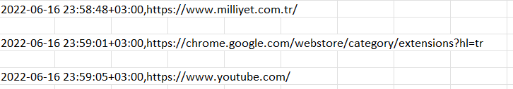
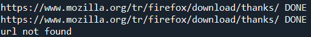
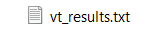
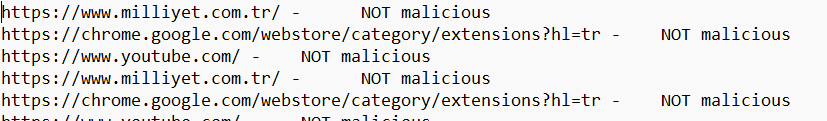

# VirusTotal_Python_URL_Scan
Scanning all browser history URLs in VirusTotal with Python

## Necessary Libraries:
| Library  | Code to install |
| ------------- | ------------- |
| browser_history  | ``` pip install browser-history ```  |
| pathlib2  | ``` pip install pathlib2 ```  |
| pybase64  |``` pip install pybase64 ``` |
| pandas |``` pip install pandas ``` |
| requests | ```pip install requests ```|


### Getting Browser History
I used browser-history 0.3.2 library to get all history from all browsers in device. Then saved into a csv file called "history.csv". Here is the example:
<br>


||
|---------|
| Browser histories with Timestamp |

<br>
Then I take all the URLs to a list in order to scan properly in VirusTotal.

<br>

### Scanning URL in VirusTotal
With VirusTotal API, script is scanning all the URLs one by one with in every 15 second. (You can't scan more than 4 URL in a minute if you are a regular user)
<br>
When scanning completed for an URL, it'll show up like that in terminal:
<br>
||
|---------|
| Scanned URL |
<br> 
Sometimes VirusTotal couldn't find the URL if it's a search in Browser or any other circumstances.

### Saving the results to a file
After the scannning completed for an URL. It writes the result to a file called "vt_results". It is decided by looking the "malicious" number in "last_analysis_stats". If "malicious" is more than 4, it'll be written as MALICIOUS. If "malicious" is 0, then it'll be NOT MALICIOUS

|||
|---------|---------|
| File | Results |
